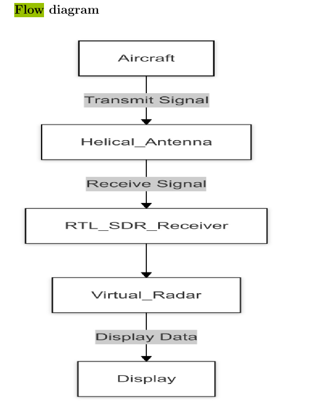
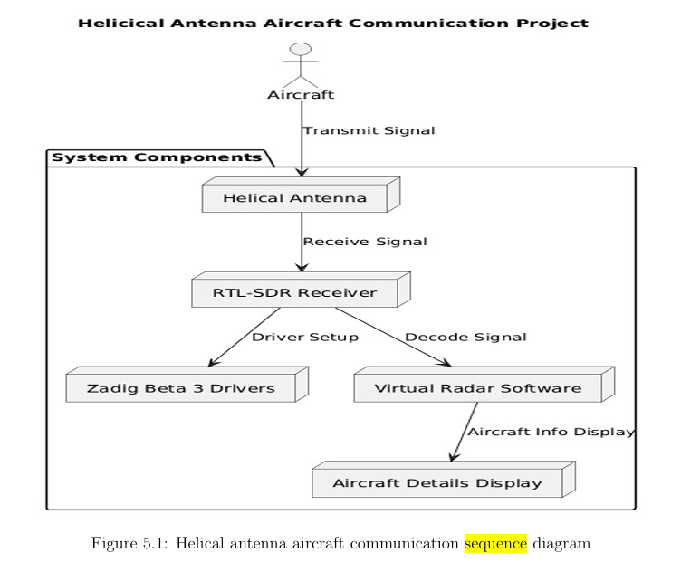
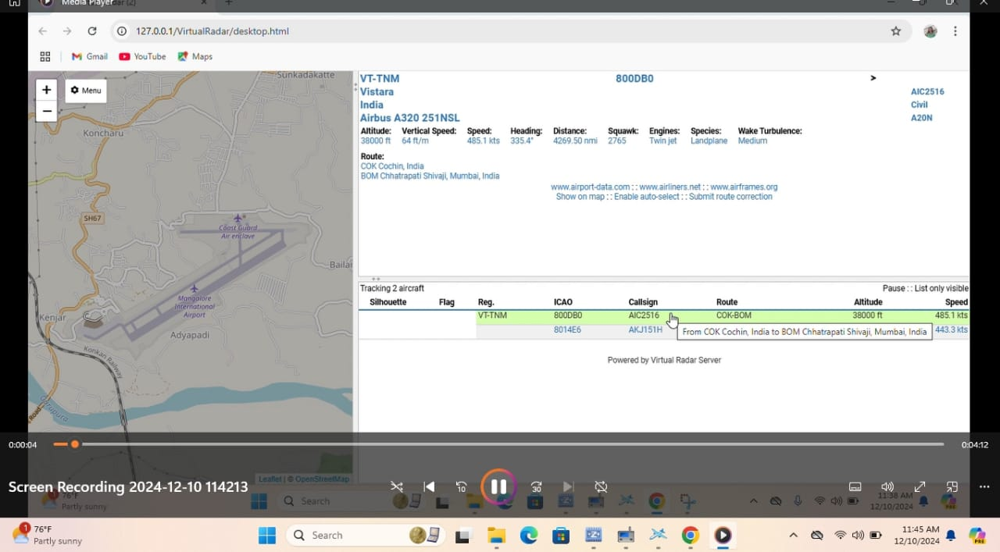
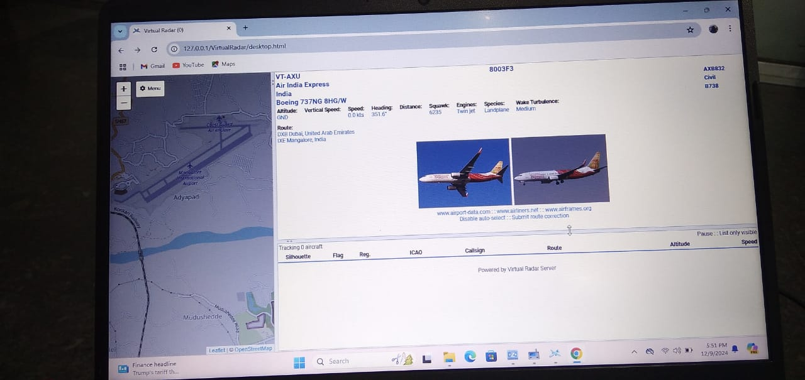
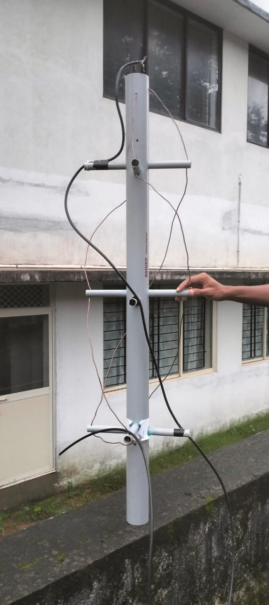

# Helical Antenna for Aircraft Communication

## 📡 Overview
This project demonstrates the design and implementation of a **Helical Antenna system** integrated with **Software Defined Radio (RTL-SDR)** and **Virtual Radar Server** for real-time aircraft signal reception and tracking.  
The system decodes **ADS-B (Automatic Dependent Surveillance–Broadcast)** signals transmitted by aircraft at **1090 MHz**, displaying live flight data such as **flight ID, altitude, speed, and route (from–to destinations)**.

Developed as a **final-year ECE major project** at **Canara Engineering College (VTU Belagavi)**, it provides a cost-effective setup for **aviation monitoring** and **communication research**.

---

## 🧠 Technologies Used

| Component | Description |
|------------|-------------|
| **Signal Receiver** | RTL-SDR (Software Defined Radio) |
| **Software Tools** | SDR# (SDRSharp), RTL1090, Virtual Radar Server |
| **Data Type** | ADS-B Aircraft Communication Signals |
| **Frequency** | 1090 MHz |
| **Interface** | Laptop Display (Real-time Aircraft Tracking) |
| **Platform** | Windows 11 |
| **Additional Tools** | Zadig Driver, Coaxial Cable Adapters (BNC–MCX) |

---

## ⚙️ System Architecture
### 🧩 Flow Diagram

### 🧩 Sequence Diagram

---

## 🧰 Implementation Steps

1. **Antenna Design:**  
   A helical antenna was constructed and tuned for **1090 MHz**, optimized for circular polarization to capture ADS-B signals effectively.

2. **Signal Reception:**  
   The antenna feeds signals to the **RTL-SDR dongle**, which converts RF signals into digital data.

3. **Signal Processing:**  
   - **SDR# (SDRSharp)** visualizes and tunes the incoming signals.  
   - **RTL1090** decodes the raw ADS-B data.  
   - **Virtual Radar Server** interprets and displays decoded aircraft data in real time.

4. **Visualization:**  
   Aircraft data such as flight ID, altitude, speed, and route details are displayed on a map interface.

---

## 💡 Key Features

- Real-time reception and decoding of **ADS-B aircraft signals**.  
- Integration of **Virtual Radar Server** for interactive data visualization.  
- Displays live aircraft details such as **flight ID, altitude, speed, and route information**.  
- Compact and cost-efficient system suitable for **aviation research** and **communication studies**.  
- Uses open-source SDR tools for flexible signal analysis.

---

## 🖥️ Output Snapshots

### 🔹 Virtual Radar Interface

### 🔹 Helical Antenna Setup

### 🔹 Virtual Radar Server Interface

---

## 📊 Results

- Successfully captured **ADS-B signals at 1090 MHz**.  
- Decoded real-time **aircraft communication data** including:
  - Flight ID  
  - Altitude  
  - Speed  
  - Route (from–to destination)  
- Visualized aircraft movement and data on **Virtual Radar Server**.  
- Validated as a **functional and reliable communication model** for air traffic tracking.

---

## 🏆 Achievements
- 🥇 **Best Major Project Award (2024–2025)**  
  *Canara Engineering College, Department of Electronics and Communication Engineering.*  
-  🧩 **KSCST Sponsorship (48th Series, 2024–2025)**
   Project proposal titled **“Helical Antenna for Aircraft Communication”** approved for sponsorship by the Karnataka State Council for Science and Technology (KSCST).
---

## 👩‍💻 Team Members

| Name | USN |
|------|-----|
| Aishwarya H S | 4CB21EC001 |
| Lata Keshav Naik | 4CB21EC020 |
| Sonali S | 4CB21EC053 |
| Spandana | 4CB21EC054 |

**Guide:** Mr. Sreerama Samartha  
**Department:** Electronics and Communication Engineering  
**Institution:** Canara Engineering College, Mangaluru  
**University:** Visvesvaraya Technological University (VTU), Belagavi

---

## 🧭 Future Enhancements
- Integration with **Raspberry Pi** for standalone real-time tracking.  
- Deployment of a **web dashboard** for remote monitoring.  
- Implementation of **multi-band antenna arrays** for extended frequency reception.  
- Addition of **machine learning models** for aircraft route prediction.

---

## 📄 Project Report
📘 [Download Full Project Report (PDF)](REPORT/Helical%20Antenna%20for%20Aircraft%20Communication.pdf)

---

## 🏷️ Tags
`RTL-SDR` · `Virtual Radar Server` · `ADS-B` · `Signal Processing` · `Aviation Communication` · `ECE Project` · `Helical Antenna` · `Air Traffic Monitoring`  

---

## 📜 License
This project is an academic submission under **Canara Engineering College** (VTU Belagavi) and is intended for **educational and research purposes** only.
